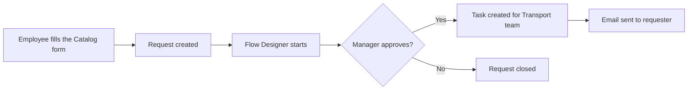

# Car Rental Request Automation in ServiceNow

Automating car rental requests using ServiceNow **Service Catalog** and **Flow Designer**.

Built as part of the SkillWallet ServiceNow Global Certification Program.

---

## Project Overview

In many organizations, employees who need a car for official work have to call or email someone, wait for approval, and then wait again for a car to be arranged. This is slow, easy to forget, and hard to track.

This project fixes that inside ServiceNow. An employee fills out a simple form, a manager approves it, and the transport team is automatically given a task to arrange the car. The employee gets an email once the request is approved.

No manual follow-ups. No lost requests.

---

## Objectives

- Give employees one simple, standard form to request a car
- Automatically send each request to a manager for approval
- Automatically create a task for the Transport team after approval
- Send an email to the requester when the request is approved
- Reduce manual work and mistakes
- Keep every request in one place so it can be tracked and audited

---

## How It Works

1. The employee opens the car rental item in the Service Catalog and fills in the details.
2. On clicking **Order Now**, ServiceNow creates a request and gives a request number.
3. A flow starts automatically and asks the manager for approval.
4. If approved, a task is created and assigned to the Transport team.
5. The employee receives an email saying the request is approved.

---

## Architecture

The project has three simple layers.

### 1. Front end: what the user sees

- A **Service Catalog form** where the user enters the request details
- The **Service Portal** where the user can check the status of the request

**Form fields (catalog variables):**

| Field | Type |
|-------|------|
| Requested Date | Date |
| Pickup Location | Single Line Text |
| Drop Location | Single Line Text |
| Duration | Numeric Scale |
| Car Type | Select Box (Mini, SUV, Sedan) |
| Reason | Multi Line Text |

### 2. Automation: what runs in the background

A flow called **Car Rental Req**, built in Flow Designer:

- **Trigger:** starts when a Service Catalog request is submitted
- **Action 1:** Ask for Approval (sent to the manager)
- **Condition:** if the request is approved
- **Action 2:** Create Catalog Task (assigned to the Transport team)
- **Action 3:** Send Email to the requester

### 3. Data: where information is stored

| Table | What it stores |
|-------|----------------|
| Request (REQ) | The overall car rental request |
| Requested Item (RITM) | The specific car rental item being requested |
| Catalog Task (SCTASK) | The task given to the Transport team |
| Approval tables | Who approved or rejected, and when |
| Car Inventory (optional) | Which cars are available |

All requests, approvals and notifications are logged, so everything can be audited later.

---

## Who Uses It

| User | What they do |
|------|--------------|
| Employee | Submits the car rental request |
| Manager | Approves or rejects the request |
| Transport team | Arranges the car after approval |
| ServiceNow admin | Maintains the catalog item and the flow |

---

## Tools and Requirements

- A ServiceNow instance with admin access
- Service Catalog
- Flow Designer
- Update Set (used to track and move all configuration between instances)

---

## Author

**Suresh Katta**
